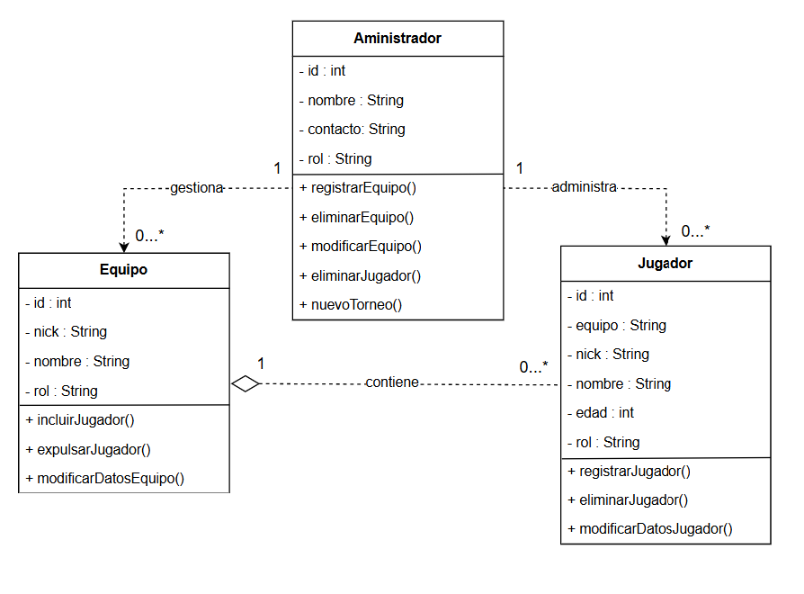

# Sistema de Gestión de Torneos de eSports

## Autor 
Alberto Balaguer Gómez

Github: AlbertoBalaguerUnir

## Descripción del Proyecto
El proyecto se basa en el diseño de un sistema infromático basado en la gestion e interacción de los distintos actores y clases en un torneo de eSports. Emplearemos UML para su modelado.

Comenzamos con el diagrama de casos de uso, para el cual hemos decretado la participación de 3 actores; administrador, jugador y sistema. Siendo éste último, el encargado de los procesos automáticos en el sistema.

Por último, procedemos al desarrollo del diagrama de clases, organizando las distintas clases, con sus atributos y métodos.

Link al repositorio del proyecto: https://github.com/AlbertoBalaguerUnir/torneo-esports-um

##Diagramas UML
 ### Diagrama de Casos de Uso
  

### Diagrama de Clases
  

##Estructura del Proyecto

torneo-esports-uml/ ├── src/
| ├── es/empresa/torneo/
| ├── modelo/
| ├── control/
| ├── vista/
| ├── Main.java
├── diagrams/
| ├── casos-uso.png
| ├── clases.png
├── README.md
├── .gitignore

## Instalación y Ejecución
1. Clonar el repositorio:
`git clone https://github.com/AlbertoBalaguerUnir/torneo-esports-uml.git`

2. Compilar y ejecutar el proyecto:
`cd src javac es/empresa/torneo/Main.java java es.empresa.torneo.Main`

## Justificación del diseño

## Conclusiones
El proyecto ha significado la primera toma de contacto con el diseño en UML.

  
