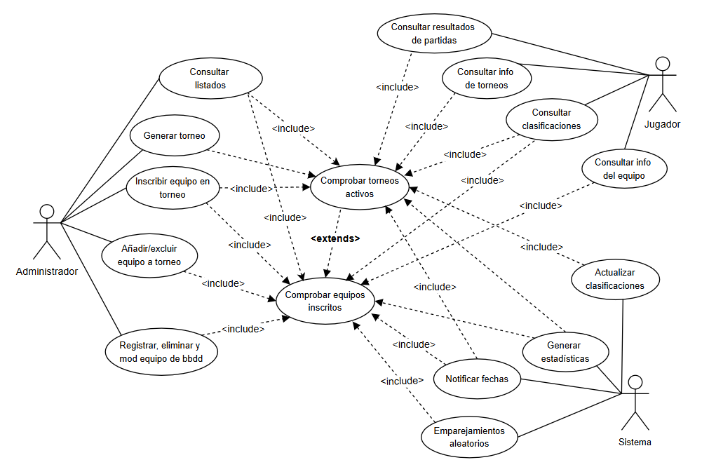

# Sistema de Gestión de Torneos de eSports

## Autor 
Alberto Balaguer Gómez

Github: AlbertoBalaguerUnir

## Descripción del Proyecto
El proyecto se basa en el diseño de un sistema infromático basado en la gestion e interacción de los distintos actores y clases en un torneo de eSports. Emplearemos UML para su modelado.

Comenzamos con el diagrama de casos de uso, para el cual hemos decretado la participación de 3 actores; administrador, jugador y sistema. Siendo éste último, el encargado de los procesos automáticos en el sistema.

Por último, procedemos al desarrollo del diagrama de clases, organizando las distintas clases, con sus atributos y métodos.

Link al repositorio del proyecto: [https://github.com/AlbertoBalaguerUnir/torneo-esports-um](https://github.com/AlbertoBalaguerUnir/torneo-esports-uml.git)

## Diagramas UML
 ### Diagrama de Casos de Uso
  

### Diagrama de Clases
  

## Estructura del Proyecto

torneo-esports-uml/
├── diagrams/
| ├── casos-uso.png
| ├── clases.png
├── README.md
├── .gitignore

## Instalación y Ejecución
1. Clonar el repositorio:
`git clone https://github.com/AlbertoBalaguerUnir/torneo-esports-uml.git`

## Justificación del diseño
El empleo de UML radica en su capacidad para facilitar la comunicación y la comprensión de sistemas complejos. Nos permite representar la estructura, el comportamiento y las interacciones de un sistema de software de manera concisa.  

## Conclusiones
El proyecto ha significado la primera toma de contacto con UML, el lenguaje estandarizado de modelado visual para el diseño de sistemas de software.
